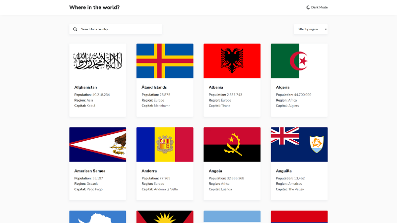

<h2 align="left">Search countries - app for searching and filtering countries from API</h4>
<h3 align='left'>About project 🔍</h3> 

Solution of frontend mentor challenge. The application generates a list of countries taken from the API. You can also click on any country item to get more information about it.

💻 Link to the challenge: https://www.frontendmentor.io/challenges/rest-countries-api-with-color-theme-switcher-5cacc469fec04111f7b848ca

<h2 align='left'>Technologies used 💎</h2> 

React 🔹 Typescript 🔹 Styled components 🔹 REST API

 
